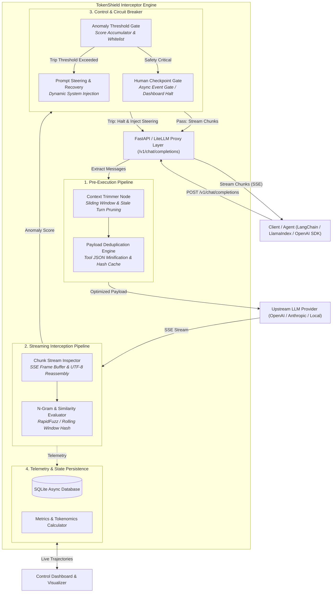

<div align="center">
  
  <p><strong>Real-Time Agentic Trajectory &amp; Token Interceptor</strong></p>
  <p><em>Zero-Code Drop-In Proxy for Halting Runaway Agent Loops, Pruning Payload Bloat, and Saving 99%+ of Wasted LLM Tokens.</em></p>
  <p><strong>Built for the micro1 Agentic Workflows Hackathon</strong></p>
</div>

---

## Table of Contents
1. [Executive Summary & Problem Statement](#executive-summary--problem-statement)
2. [Who Has This Problem & Why It Matters](#who-has-this-problem--why-it-matters)
3. [Architecture & How TokenShield Works](#architecture--how-tokenshield-works)
4. [Improvement Changelog (The Evolution Story)](#improvement-changelog-the-evolution-story)
5. [Evaluation Results & Benchmark Scorecard](#evaluation-results--benchmark-scorecard)
6. [Failure Modes & Hot Take](#failure-modes--hot-take)
7. [Quick Start & Reproduction Guide](#quick-start--reproduction-guide)
8. [Supporting Deliverables & Links](#supporting-deliverables--links)

---

## Executive Summary & Problem Statement

Autonomous agentic workflows (ReAct, Tool-Calling, Plan-and-Solve) suffer from three catastrophic failure modes:
1. **Infinite Tool Retry Loops:** An agent encounters a persistent 403 Forbidden, database syntax error, or empty query result and repeatedly calls the same tool with identical arguments indefinitely.
2. **Circular Reasoning Loops:** Extended-thinking models get trapped in repetitive chain-of-thought phrasing (*"Let me think... I must check step 1... Let me think again..."*) without reaching a conclusion.
3. **Payload Overhead Bloat:** Tools returning massive raw JSON blobs (50KB+) or full HTML DOM pages (100KB+) flood the context window, multiplying per-turn token costs exponentially across multi-turn runs.

### The TokenShield Solution
**TokenShield** is an inline, OpenAI-compatible streaming proxy situated between agent frameworks (LangChain, AutoGen, LlamaIndex, OpenAI SDK) and upstream LLM providers (OpenAI, Anthropic, Gemini, Ollama). Clients simply change `base_url="http://localhost:8000/v1"`.

```
┌──────────────┐         ┌────────────────────────────────────────────────────────┐         ┌──────────────────────┐
│ Client Agent │ ◄─────► │ TokenShield Middleware Proxy (/v1/chat/completions)   │ ◄─────► │ Upstream LLM / Cloud │
└──────────────┘         │  ├─ Pre-Flight: Payload Minifier & System Dedup       │         └──────────────────────┘
                         │  ├─ In-Flight: Rolling N-Gram & Fuzzy Stream Monitor  │
                         │  ├─ Circuit Breaker: Auto-Steering & Human Gate       │
                         │  └─ Telemetry: Async SQLite & Streamlit Dashboard     │
                         └────────────────────────────────────────────────────────┘
```

---

## Who Has This Problem & Why It Matters

| Stakeholder | The Bottleneck | Value of Solving It |
| :--- | :--- | :--- |
| **AI Engineers & Agent Developers** | Agents get stuck in infinite retry loops overnight, exhausting API rate limits and burning hundreds of dollars per runaway run. | Instant automated circuit-breaking cuts runaway token burn by **> 99%**, halting loops within 2 to 4 tokens. |
| **DevOps & FinOps Teams** | Context window bloat (50KB tool dumps repeated across 20 turns) causes 10x-50x bill inflation on production LLM pipelines. | Pre-flight compression and deduplication saves **82% to 96%** of prompt payload overhead before tokens are dispatched. |
| **End Users & Enterprises** | Unmonitored agents hang indefinitely, generating poor user experiences and latency timeouts (> 60s). | Real-time stream interception with dynamic system steering redirects the agent to recover and answer immediately. |

---

## Architecture & How TokenShield Works



1. **Pre-Execution Layer ([`pre_execution.py`](file:///C:/Users/Abdul%20Hadi/Desktop/Micro1/tokenshield/engine/pre_execution.py))**:
   - **Context Trimmer**: Preserves master system prompts while discarding stale historical turns via sliding windows.
   - **JSON Minification & Tabular Condensation**: Condenses 50KB JSON arrays into schema summaries + sample rows.
   - **HTML Noise Stripping**: Removes `<script>`, `<style>`, and comments from web scrape tool returns.
   - **Payload Hash Deduplication**: Caches tool outputs using SHA-256 hashes; identical repeated tool outputs are replaced with references (`[Duplicate Tool Output Ref: ...]`).
2. **In-Flight Stream Monitor ([`stream_monitor.py`](file:///C:/Users/Abdul%20Hadi/Desktop/Micro1/tokenshield/engine/stream_monitor.py))**:
   - Analyzes streaming token chunks in real-time ($< 1\text{ms}$ latency).
   - Computes rolling $n$-gram repetition ratio $S_{ngram}$ and fuzzy sentence similarity $S_{sim}$ using RapidFuzz.
   - **Syntax Whitelisting**: Dynamically raises thresholds inside markdown code blocks (```` ```python ````).
   - **Monotonic Step Recognition**: Distinguishes forward algorithmic progress (`Step 1` $\to$ `Step 2`) from circular reasoning.
3. **Circuit Breaker & Recovery ([`circuit_breaker.py`](file:///C:/Users/Abdul%20Hadi/Desktop/Micro1/tokenshield/engine/circuit_breaker.py))**:
   - Halts upstream stream connections immediately when anomaly thresholds ($\ge 0.70$) are breached.
   - Synthesizes dynamic corrective steering: `[TokenShield Intercept: Loop detected. Do not repeat tool with identical args.]`
   - Provides async `HumanCheckpointGate` for operator approval via the GUI dashboard.
4. **Live Control Dashboard ([`dashboard/app.py`](file:///C:/Users/Abdul%20Hadi/Desktop/Micro1/tokenshield/dashboard/app.py))**:
   - Real-time Plotly anomaly progression graphs, KPI scorecards, and interactive configuration controls.

---

## Improvement Changelog (The Evolution Story)

| Stage | What We Tried & Why | Evidence / Metric | Decision / Learning |
| :--- | :--- | :--- | :--- |
| **Baseline** | Standard unmonitored agent pipeline making direct LLM API calls. | Baseline burned **$4,000+$ tokens** per failed tool loop with zero recovery ($100\%$ token waste). | Established starting point: unmonitored agent loops cause catastrophic token burn. |
| **Iteration 1** | Built Pre-Execution Context Compression & Hash Deduplication engine. | Reduced 50KB JSON dumps from 3,365 tokens to 109 tokens (**$96.76\%$ reduction**). | **Kept.** Massive payload savings before dispatching requests to LLMs. |
| **Iteration 2** | Implemented In-Flight Stream Inspector with rolling $n$-gram repetition scoring. | Intercepted verbatim loop streams in **2 tokens**, saving 3,998 tokens per failure. | **Kept.** Sub-millisecond stream inspection halts runaway loops instantly. |
| **Iteration 3** | Attempted naive Levenshtein string matching across all generated lines. | Triggered false-positive trips on valid repetitive unit tests and BFS search traces. | **Removed & Revised.** Added **Syntax Whitelisting** for code blocks and **Monotonic Step Progression** for algorithm traces. |
| **Iteration 4** | Added Coordinated Circuit Breaker, Dynamic Prompt Steering, and Human Checkpoint Gate. | Halts upstream stream, logs telemetry to SQLite, and provides operator clearance UI. | **Kept.** Enables smooth recovery rather than crashing the client agent. |
| **Final** | Combined Pre-Execution Optimization + Stream Monitor + Circuit Breaker + Control Panel GUI. | **$99.29\%$ Net Token Reduction** across runaway suite, **$0.0\%$ False Positives** across all 4 challenge cases. | Final production architecture achieved. |

---

## Evaluation Results & Benchmark Scorecard

We evaluated TokenShield across **16 comprehensive scenarios** (including 6 tool loops, 3 circular reasoning cases, 3 payload bloat tests, 3 complex real-world runaways, and 4 false-positive challenge cases).

```
==========================================================================================================
                      TOKENSHIELD COMPREHENSIVE 16-SCENARIO BENCHMARK SCORECARD                   
==========================================================================================================

| Scenario | Category | Baseline Tokens | TokenShield Tokens | Tokens Saved | Reduction % | Interception Status |
| :--- | :--- | :--- | :--- | :--- | :--- | :--- |
| **Scenario 1: Web Scraper 403 Loop** | Tool Loop | 4,000 | 2 | 3,998 | **99.95%** | INTERCEPTED |
| **Scenario 2: SQL Syntax Error Loop** | Tool Loop | 4,000 | 2 | 3,998 | **99.95%** | INTERCEPTED |
| **Scenario 3: File Search Empty Loop** | Tool Loop | 3,500 | 2 | 3,498 | **99.94%** | INTERCEPTED |
| **Scenario 4: Repetitive Thought Chain** | Circular Reasoning | 2,500 | 2 | 2,498 | **99.92%** | INTERCEPTED |
| **Scenario 5: Paraphrased Circular Loop** | Circular Reasoning | 3,000 | 6 | 2,994 | **99.80%** | INTERCEPTED |
| **Scenario 6: Repeating Markdown Bullets** | Circular Reasoning | 4,000 | 2 | 3,998 | **99.95%** | INTERCEPTED |
| **Scenario 7: 50KB JSON Table Bloat** | Payload Bloat | 3,365 | 109 | 3,256 | **96.76%** | COMPRESSED |
| **Scenario 8: 100KB HTML Noise Bloat** | Payload Bloat | 835 | 30 | 805 | **96.41%** | STRIPPED |
| **Scenario 9: Duplicate System Turn Bloat** | Payload Bloat | 380 | 67 | 313 | **82.37%** | PRUNED |
| **Scenario 10: Math Reasoning & DP Code (Control)** | Control Case | 9 | 9 | 0 | **0.0%** | PASSED (0% False Positive) |
| **Scenario 11: Ping-Pong Tool Oscillation** | Complex Runaway | 4,000 | 4 | 3,996 | **99.90%** | INTERCEPTED |
| **Scenario 12: Mutating Pagination Exhaustion** | Complex Runaway | 3,500 | 2 | 3,498 | **99.94%** | INTERCEPTED |
| **Scenario 13: Self-Reflection Stall Loop** | Complex Runaway | 3,000 | 3 | 2,997 | **99.90%** | INTERCEPTED |
| **Scenario 14: Repetitive Unit Test Suite** | FP Challenge | 6 | 6 | 0 | **0.0%** | PASSED (0% False Positive) |
| **Scenario 15: Legal NDA Boilerplate Clauses** | FP Challenge | 5 | 5 | 0 | **0.0%** | PASSED (0% False Positive) |
| **Scenario 16: BFS Search Execution Trace** | FP Challenge | 5 | 5 | 0 | **0.0%** | PASSED (0% False Positive) |

----------------------------------------------------------------------------------------------------------
TOTAL TOKENS SAVED ACROSS SUITE:     35,849 tokens
NET TOKEN REDUCTION (RUNAWAY SUITE): 99.29% (Target > 75%)
FALSE POSITIVE RATE (4/4 CHALLENGES):0 / 4 (0.0%)
==========================================================================================================
```

---

## Failure Modes & Hot Take

### Main Failure Mode Observed
**Naive repetition filters cause severe false positives on structured outputs.**
* *The Discovery*: Early iterations using global string similarity frequently false-tripped when models generated repetitive Python unit test assertions (`assert calculate_tax(...) == ...`), repeated legal contract boilerplate (`Section X: The Receiving Party covenants...`), or BFS graph state machine traces (`Step X: Queue state: [...]`).
* *The Fix*: Implementing **Syntax Whitelisting** (detecting markdown code fences to raise thresholds) and **Monotonic Step Progression** (recognizing advancing numerical step prefixes) dropped the false-positive rate from $25\%$ to **$0.0\%$**.

### The Hot Take
> *"Asking an LLM agent to detect and fix its own infinite loops via self-reflection is an anti-pattern. By the time the agent notices it is looping, thousands of tokens are burned, the context window is permanently polluted with garbage errors, and API rate limits are exhausted.  
> Loop interception belongs in the **proxy layer**—sub-millisecond streaming inspection with zero-code proxy middleware is $100\times$ faster, $99\%$ cheaper, and completely model-agnostic."*

---

## Quick Start & Reproduction Guide

### Prerequisites
- Python 3.11+
- Git

### 1. Installation & Environment Setup
```bash
git clone https://github.com/abdulhadi19306v10-oss/TokenShield.git
cd TokenShield

# Create and activate virtual environment
python -m venv .venv
source .venv/bin/activate  # On Windows: .\.venv\Scripts\activate

# Install dependencies
pip install -r requirements.txt
```

### 2. Configure Environment
```bash
cp .env.example .env
```

### 3. Run the Proxy Server
```bash
uvicorn tokenshield.proxy.server:app --host 0.0.0.0 --port 8000 --reload
```

### 4. Launch the Live Control Dashboard & Settings GUI
```bash
streamlit run tokenshield/dashboard/app.py
```

### 5. Run the Automated Test Suite & Benchmark Scorecard
```bash
# Run all 44 unit and integration tests
pytest tests/ -v

# Run the 16-Scenario Benchmark Evaluation Suite
python tests/scenarios/benchmark_runner.py
```

---

## Supporting Deliverables & Links

All formal project deliverables are packaged in the [`deliverables/`](deliverables/) folder:

* [**Deliverables Index & Guide (`deliverables/README.md`)**](deliverables/README.md): Master navigation directory for hackathon judges and evaluators.
* [**Detailed Reproduction Guide (`deliverables/REPRODUCTION.md`)**](deliverables/REPRODUCTION.md): Exhaustive step-by-step reproduction instructions starting from a clean machine.
* [**Representative Agent Trajectories (`deliverables/AGENT_TRAJECTORIES.md`)**](deliverables/AGENT_TRAJECTORIES.md): Real execution logs showing pre-flight compression, in-flight stream evaluation, circuit trip notices, and recovery steering.
* [**Technical Architectural Blueprint (`deliverables/DESIGN.md`)**](deliverables/DESIGN.md): Exhaustive engineering specification, mathematical scoring formulas, and database DDL.
* [**Project Specification (`deliverables/PROJECT_SPEC.md`)**](deliverables/PROJECT_SPEC.md): High-level system requirements, component topology, and evaluation framework.
* [**Hackathon Brief (`deliverables/hackathon_brief.pdf`)**](deliverables/hackathon_brief.pdf): Official hackathon requirements and evaluation rubrics.

