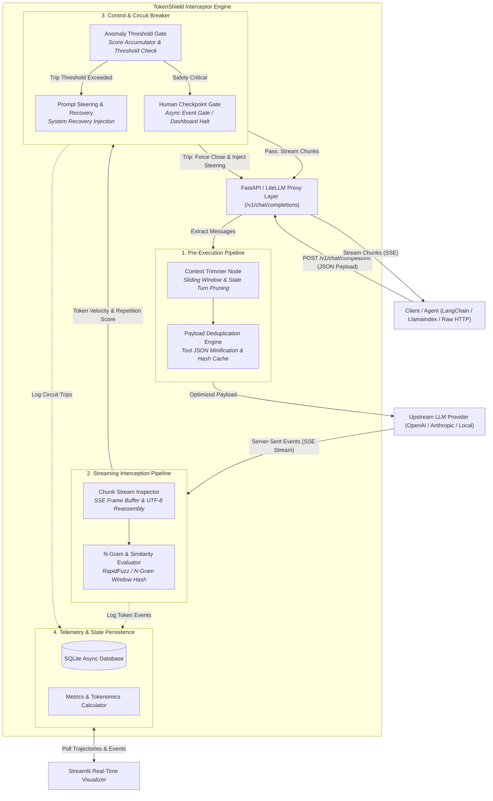
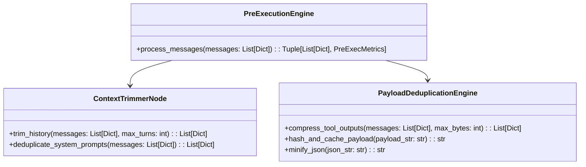
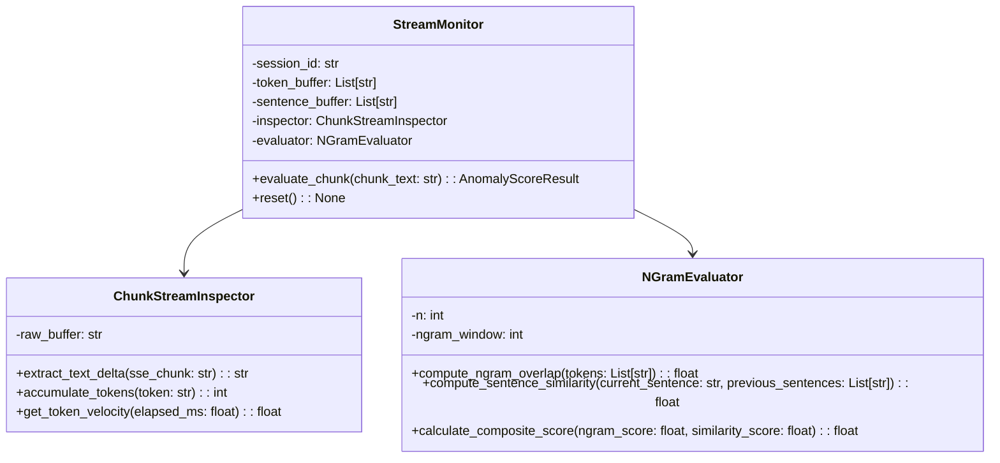
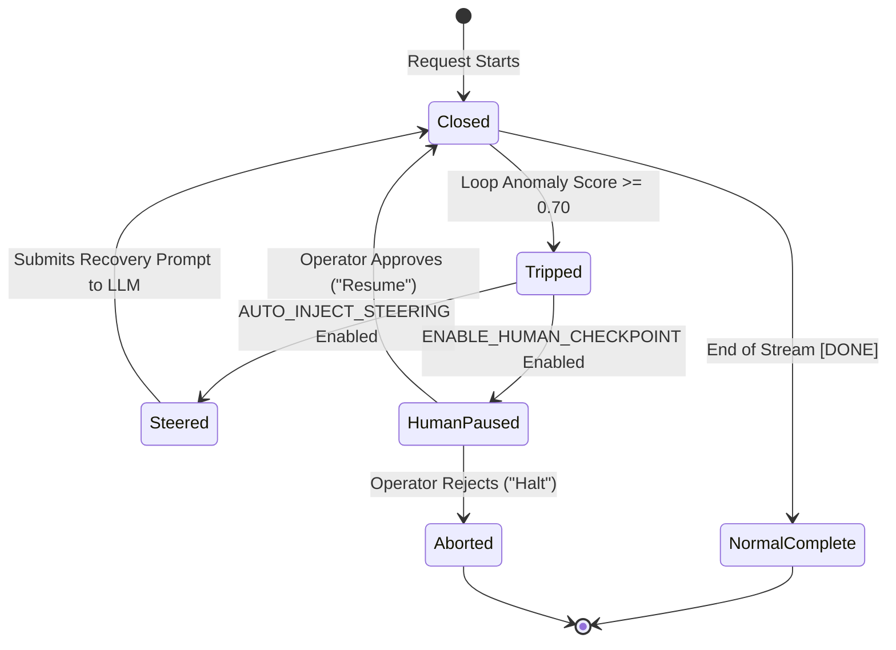
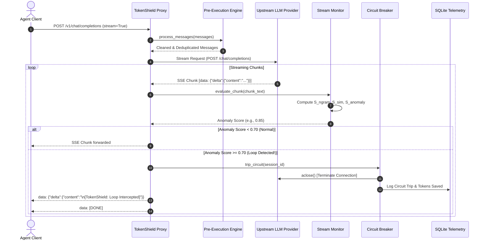

# TokenShield: Exhaustive Technical Design & Architectural Blueprint

> **Document Version:** 1.0.0  
> **Status:** Approved for Implementation  
> **Target Runtime:** Python 3.11+ (Async IO)  
> **Primary Interfaces:** OpenAI-Compatible REST / SSE Proxy (`/v1/chat/completions`), SQLite Telemetry Engine, Streamlit Control Panel

---

## Table of Contents
1. [Executive Summary & Core Philosophy](#1-executive-summary--core-philosophy)
2. [End-to-End System Architecture](#2-end-to-end-system-architecture)
3. [Repository Layout & Directory Organization](#3-repository-layout--directory-organization)
4. [Exhaustive Component & Function-Level Design](#4-exhaustive-component--function-level-design)
   - [4.1 Configuration Layer (`src/config.py`)](#41-configuration-layer-srcconfigpy)
   - [4.2 Proxy & Ingestion Layer (`src/proxy/`)](#42-proxy--ingestion-layer-srcproxy)
   - [4.3 Pre-Execution Layer (`src/engine/pre_execution.py`)](#43-pre-execution-layer-srcenginepre_executionpy)
   - [4.4 Real-Time Streaming Monitor (`src/engine/stream_monitor.py`)](#44-real-time-streaming-monitor-srcenginestream_monitorpy)
   - [4.5 Circuit Breaker & Recovery Engine (`src/engine/circuit_breaker.py`)](#45-circuit-breaker--recovery-engine-srcenginecircuit_breakerpy)
   - [4.6 Telemetry, Database & Metrics (`src/telemetry/`)](#46-telemetry-database--metrics-srctelemetry)
   - [4.7 Dashboard & Human Checkpoint (`src/dashboard/`)](#47-dashboard--human-checkpoint-srcdashboard)
5. [Mathematical Formulations & Scoring Algorithms](#5-mathematical-formulations--scoring-algorithms)
6. [Detailed Execution Workflows & Sequence Diagrams](#6-detailed-execution-workflows--sequence-diagrams)
7. [Benchmark Evaluation Framework (10 Scenarios)](#7-benchmark-evaluation-framework-10-scenarios)
8. [Edge Cases, Error Handling & Failure Modes](#8-edge-cases-error-handling--failure-modes)
9. [Step-by-Step Implementation Roadmap](#9-step-by-step-implementation-roadmap)

---

## 1. Executive Summary & Core Philosophy

### 1.1 The Problem
Autonomous AI agents operating in agentic loops (e.g., ReAct, Plan-and-Solve, Tool-Calling agents) suffer from three catastrophic failure modes:
1. **Infinite Tool Loops:** An agent calls a tool that fails or returns an uninformative error, causing the agent to repeatedly call the exact same tool with identical or slightly mutated arguments indefinitely.
2. **Circular Reasoning Loops:** An LLM generates verbose repetitive chain-of-thought phrases (e.g., *"Let me think... I should check the file. Now I will check the file. Let me think again..."*) without emitting a stop token or tool call.
3. **Payload Overhead Bloat:** Tools returning massive raw JSON blobs or HTML payloads (e.g., 50KB database responses) consume context window budgets, causing exponentially increasing per-token costs on every subsequent multi-turn iteration.

### 1.2 The TokenShield Solution
**TokenShield** operates as an inline, zero-code-modification HTTP/SSE proxy situated between the client agent framework and upstream LLM providers (e.g., OpenAI, Anthropic, Gemini, Ollama, LiteLLM). 

```
┌──────────────┐         ┌──────────────────────────────────────┐         ┌──────────────────────┐
│ Client Agent │ ◄─────► │ TokenShield Real-Time Proxy & Engine │ ◄─────► │ Upstream LLM / Cloud │
└──────────────┘         └──────────────────────────────────────┘         └──────────────────────┘
```

#### Why Middleware Proxy?
* **Drop-in Compatibility:** Exposes standard OpenAI-compatible endpoints (`/v1/chat/completions`). Clients simply set `base_url="http://localhost:8000/v1"`.
* **Zero Latency Penalty:** Performs pre-flight compression in $< 2\text{ms}$ and inspects streaming tokens in-flight with $< 1\text{ms}$ overhead per chunk using rolling hash sliding windows.
* **Proactive Interception:** Rather than waiting for a request to finish 4,000 runaway tokens, TokenShield severs the upstream connection within 5-10 duplicate tokens, saving $> 75\%$ of wasted costs.

---

## 2. End-to-End System Architecture



---

## 3. Repository Layout & Directory Organization

```
Micro1/
├── .venv/                         # Python 3.11 Virtual Environment
├── requirements.txt               # Project dependency specification
├── project.md                     # High-level architecture & specification guide
├── design.md                      # Exhaustive technical design document (this file)
├── .env.example                   # Environment configuration template
│
├── tokenshield/                   # Primary Source Package
│   ├── __init__.py
│   ├── config.py                  # Pydantic Settings & Global Constants
│   │
│   ├── proxy/                     # API Ingestion & Streaming Proxy
│   │   ├── __init__.py
│   │   ├── server.py              # FastAPI Application & Route Definitions
│   │   ├── handler.py             # Request Pipeline Orchestrator
│   │   └── client.py              # Async Upstream Provider Client (httpx / litellm)
│   │
│   ├── engine/                    # Core Analytical & Intervention Engines
│   │   ├── __init__.py
│   │   ├── pre_execution.py       # Context Trimmer & Tool Payload Deduplicator
│   │   ├── stream_monitor.py      # Chunk Stream Inspector & N-Gram Evaluator
│   │   └── circuit_breaker.py     # Anomaly Threshold Gate & Prompt Steering Node
│   │
│   ├── telemetry/                 # Database, Storage & Metrics
│   │   ├── __init__.py
│   │   ├── database.py            # Async SQLite Connection Manager (aiosqlite)
│   │   ├── models.py              # Pydantic & SQLAlchemy Models
│   │   └── metrics.py             # Tokenomics Calculator & Savings Analyzer
│   │
│   └── dashboard/                 # Streamlit Live Telemetry & Control Panel
│       ├── __init__.py
│       └── app.py                 # Streamlit Multi-Page UI Application
│
└── tests/                         # Comprehensive Test & Benchmark Suite
    ├── __init__.py
    ├── conftest.py                # Pytest Fixtures & Test Setup
    ├── test_pre_execution.py      # Unit tests for Context Trimmer & Deduplicator
    ├── test_stream_monitor.py     # Unit tests for N-Gram & Levenshtein scoring
    ├── test_circuit_breaker.py    # Unit tests for Circuit Breaker & Recovery
    ├── test_proxy_pipeline.py     # End-to-end integration tests
    ├── mock_upstream.py           # Deterministic Mock LLM Provider for Testing
    └── scenarios/                 # 10 Benchmark Evaluation Scenarios
        ├── scenario_1_3_tool_loops.py
        ├── scenario_4_6_circular_reasoning.py
        ├── scenario_7_9_payload_bloat.py
        └── scenario_10_control_case.py
```

---

## 4. Exhaustive Component & Function-Level Design

### 4.1 Configuration Layer (`src/config.py`)

#### Why It Exists
Centralizes runtime configuration, environment variables, detection thresholds, and system constants into a validated Pydantic `BaseSettings` object.

#### Code Architecture & Function Specifications

```python
class TokenShieldConfig(BaseSettings):
    # Proxy Network Settings
    HOST: str = "0.0.0.0"
    PORT: int = 8000
    UPSTREAM_BASE_URL: str = "https://api.openai.com/v1"
    UPSTREAM_API_KEY: str = ""
    DEFAULT_MODEL: str = "gpt-4o-mini"
    
    # Pre-Execution Thresholds
    MAX_TOOL_PAYLOAD_BYTES: int = 4096       # Payloads > 4KB trigger key deduplication & summarization
    SLIDING_WINDOW_TURNS: int = 10           # Max conversation turns to retain before trimming
    ENABLE_DEDUPLICATION: bool = True
    
    # In-Flight Streaming & Anomaly Thresholds
    NGRAM_N: int = 3                         # 3-gram evaluation window
    NGRAM_WINDOW_TOKENS: int = 40            # Rolling token window for repetition inspection
    LOOP_ANOMALY_THRESHOLD: float = 0.70     # Anomaly score >= 0.70 triggers circuit breaker
    SIMILARITY_THRESHOLD: float = 0.85       # Levenshtein similarity >= 85% flags circular reasoning
    MIN_TOKENS_BEFORE_CHECK: int = 15        # Minimum tokens before anomaly evaluator begins scoring
    
    # Telemetry & Database
    DATABASE_PATH: str = "tokenshield_telemetry.db"
    
    # Circuit Breaker Policies
    ENABLE_HUMAN_CHECKPOINT: bool = False    # When True, halts and waits for Streamlit approval
    AUTO_INJECT_STEERING: bool = True        # Automatically injects system recovery turn on loop
```

* **`get_config() -> TokenShieldConfig`**:
  * **Caller:** All submodules during startup.
  * **Why:** Singleton accessor for cached configuration settings.
  * **How:** Returns an `lru_cache` instance of `TokenShieldConfig`.

---

### 4.2 Proxy & Ingestion Layer (`src/proxy/`)

#### 4.2.1 `src/proxy/server.py`
##### Why It Exists
Serves as the external HTTP API gateway, exposing OpenAI-compatible routes (`/v1/chat/completions`, `/v1/models`, `/health`).

##### Functions & Handlers:
* **`create_app() -> FastAPI`**:
  * **Caller:** Uvicorn CLI / Application startup.
  * **Why:** Initializes FastAPI app with lifecycle hooks (attaching SQLite connection pools on startup, closing connections on shutdown) and registering CORS & middleware.
* **`chat_completions(request: Request, payload: ChatCompletionRequest) -> Response`**:
  * **HTTP Endpoint:** `POST /v1/chat/completions`
  * **Caller:** Client LLM agent or framework (LangChain, AutoGen, LlamaIndex, OpenAI SDK).
  * **Why:** Main entrypoint for agent chat requests.
  * **How:**
    1. Extracts client request payload and session ID (from headers or generated UUID).
    2. Instantiates `ProxyHandler`.
    3. If `payload.stream == True`: returns `StreamingResponse(handler.stream_chat_completion(payload), media_type="text/event-stream")`.
    4. If `payload.stream == False`: returns `JSONResponse(await handler.sync_chat_completion(payload))`.
* **`health_check() -> Dict[str, Any]`**:
  * **HTTP Endpoint:** `GET /health`
  * **Why:** Probing endpoint for readiness, DB connectivity, and active session count.
* **`override_human_gate(session_id: str, action: str) -> Dict[str, str]`**:
  * **HTTP Endpoint:** `POST /v1/control/human-gate`
  * **Why:** Receives operator approval/rejection signals from the Streamlit UI dashboard.

#### 4.2.2 `src/proxy/handler.py`
##### Why It Exists
Orchestrates the lifecycle of a request: Pre-Flight $\to$ Upstream Dispatch $\to$ In-Flight Chunk Interception $\to$ Post-Flight Recovery.

##### Key Functions:
* **`stream_chat_completion(self, request: ChatCompletionRequest) -> AsyncGenerator[str, None]`**:
  * **Caller:** `server.py:chat_completions`.
  * **Why:** Main pipeline for real-time streaming chunk interception and yield.
  * **How:**
    1. **Session Init:** Creates a unique `session_id` and records `SessionStart` in Telemetry DB.
    2. **Pre-Execution:** Calls `PreExecutionEngine.process_messages(request.messages)`.
    3. **Upstream Request:** Opens an async streaming HTTP connection to the upstream provider via `UpstreamClient`.
    4. **In-Flight Loop:**
       * For each raw SSE chunk from upstream:
       * Calls `ChunkStreamInspector.feed_chunk(raw_chunk)`.
       * If text content is present: calls `StreamMonitor.evaluate(chunk_text)`.
       * Checks `CircuitBreaker.check_anomaly(score)`.
       * **If PASS:** Yields standard SSE formatted chunk `data: {...}\n\n` to client.
       * **If TRIP:**
         * Closes upstream stream immediately (`stream.aclose()`).
         * Logs `InterceptionEvent` in database.
         * Emits circuit break stop token chunk to client.
         * If `AUTO_INJECT_STEERING` enabled: synthesizes steering message into session history.
         * Breaks generator.
    5. **Post-Flight:** Calculates token count, latency, and net token savings; writes final `SessionSummary` to SQLite.

#### 4.2.3 `src/proxy/client.py`
##### Why It Exists
Asynchronous HTTP client interface communicating directly with upstream LLM APIs using `httpx.AsyncClient` or `litellm.acompletion`. Handles connection pooling, authorization headers, timeouts, and streaming chunk generators.

---

### 4.3 Pre-Execution Layer (`src/engine/pre_execution.py`)

#### Why It Exists
Reduces context window bloat *before* sending tokens to the upstream LLM. Prevents repetitive conversation history and oversized tool output payloads from exhausting context limits.

#### Classes and Functions:



##### Detailed Function Logic:
* **`ContextTrimmerNode.trim_history(messages: List[Dict[str, Any]], max_turns: int) -> List[Dict[str, Any]]`**:
  * **Caller:** `PreExecutionEngine.process_messages`.
  * **Why:** Retains the crucial initial system instructions (Index 0) and the most recent $N$ conversational turns, discarding stale intermediate turns that trigger context overflow.
  * **How:**
    1. Extracts `system` prompt(s) at the start of the list.
    2. Takes the tail `messages[-(max_turns * 2):]`.
    3. Reassembles `[system_prompt] + tail_messages`.
    4. Calculates tokens saved using `tiktoken`.

* **`PayloadDeduplicationEngine.compress_tool_outputs(messages: List[Dict[str, Any]], max_bytes: int) -> List[Dict[str, Any]]`**:
  * **Caller:** `PreExecutionEngine.process_messages`.
  * **Why:** Tools returning massive raw JSON or HTML (e.g. database query dumps, web scrape results) cause massive payload bloat.
  * **How:**
    1. Iterates over messages where `role == "tool"` or `role == "function"`.
    2. Checks byte size `len(content.encode('utf-8'))`.
    3. If $> \text{max\_bytes}$:
       * Attempts `json.loads(content)`.
       * If list of dictionaries: identifies repeated keys across objects, retains only sample rows (e.g. first 3 + schema description + total count: *"Showing 3 of 150 items: [...]"*).
       * Strips null keys, empty arrays, and extraneous formatting whitespace.
    4. If identical tool payload was returned in a previous turn: replaces with hash reference: `"[Duplicate Tool Output Ref: SHA256_HASH - Truncated to avoid repetition]"`.

---

### 4.4 Real-Time Streaming Monitor (`src/engine/stream_monitor.py`)

#### Why It Exists
Performs sub-millisecond, in-flight linguistic and token velocity analysis on streaming response chunks to detect repetition, circular reasoning, and infinite loops *as they happen*.

#### Classes and Functions:



##### Detailed Function Logic:
* **`ChunkStreamInspector.extract_text_delta(sse_chunk: str) -> str`**:
  * **Why:** Upstream SSE frames arrive in `data: {"choices":[{"delta":{"content":"..."}}]}\n\n` format. Handles multibyte UTF-8 splits across chunk boundaries.
  * **How:** Parses JSON delta safely; extracts `content` string; buffers partial frames if chunk is split across TCP packets.

* **`NGramEvaluator.compute_ngram_overlap(tokens: List[str]) -> float`**:
  * **Why:** Identifies verbatim n-gram repetition loops (e.g., *"1, 2, 3, 1, 2, 3, 1, 2, 3"* or repeated tool argument strings).
  * **How:**
    1. Generates rolling n-tuples: $G_n = \{(t_i, t_{i+1}, \dots, t_{i+n-1})\}_{i=1}^{K-n+1}$.
    2. Computes total n-grams $N_{total}$ and unique n-grams $N_{unique}$.
    3. Repetition ratio:
       $$\text{RepetitionRatio} = 1.0 - \frac{N_{unique}}{N_{total}}$$
    4. If $N_{total} \ge 10$ and $\text{RepetitionRatio} \ge 0.60$, returns high anomaly score.

* **`NGramEvaluator.compute_sentence_similarity(current_sentence: str, previous_sentences: List[str]) -> float`**:
  * **Why:** Catches *semantic circular reasoning* where exact tokens differ slightly, but the agent repeats the exact same reasoning pattern.
  * **How:**
    1. Splits accumulated text on sentence terminators (`.`, `\n`, `!`, `?`).
    2. Runs `rapidfuzz.fuzz.token_sort_ratio(current_sentence, past_sentence)` against the last 5 sentences.
    3. If any similarity exceeds `SIMILARITY_THRESHOLD` (e.g. $85\%$), flags repetitive reasoning loop.

---

### 4.5 Circuit Breaker & Recovery Engine (`src/engine/circuit_breaker.py`)

#### Why It Exists
Acts as the active intervention gate. When the streaming monitor detects an anomaly score breaching safety thresholds, the Circuit Breaker trips, halts the LLM connection, and initiates recovery steering.

#### State Machine & Transitions:



##### Functions & Methods:
* **`AnomalyThresholdGate.evaluate(anomaly_score: float, token_count: int) -> CircuitDecision`**:
  * **Caller:** `ProxyHandler.stream_chat_completion`.
  * **Why:** Determines whether to allow the stream to continue (`PASS`), issue a warning (`WARN`), or trip the circuit (`TRIP`).
  * **Decision Rule:**
    * If `token_count < MIN_TOKENS_BEFORE_CHECK`: Return `PASS`.
    * If `anomaly_score >= LOOP_ANOMALY_THRESHOLD`: Return `TRIP`.
    * Else: Return `PASS`.

* **`PromptSteeringNode.synthesize_recovery_prompt(loop_context: LoopContext) -> Dict[str, Any]`**:
  * **Caller:** `ProxyHandler` upon `TRIP`.
  * **Why:** Rather than abandoning the user task with a crash, TokenShield injects a targeted corrective system prompt into the context and allows the agent to recover.
  * **How:**
    * Synthesizes injection:
      ```json
      {
        "role": "system",
        "content": "[TokenShield Circuit Intercept] Execution loop detected: You have repeated tool calls or circular reasoning 3+ times without progress. DO NOT call the same tool with identical arguments. Change your approach or return your final answer immediately."
      }
      ```

* **`HumanCheckpointGate.request_clearance(session_id: str, snapshot: TrajectorySnapshot) -> bool`**:
  * **Caller:** `ProxyHandler` when `ENABLE_HUMAN_CHECKPOINT == True`.
  * **Why:** In mission-critical environments (financial trades, file deletion tools), halts execution and waits for human operator approval on the Streamlit dashboard before resuming.
  * **How:** Creates an `asyncio.Event` indexed by `session_id`; waits with a timeout (e.g. 60 seconds) until the `/v1/control/human-gate` endpoint sets the event.

---

### 4.6 Telemetry, Database & Metrics (`src/telemetry/`)

#### 4.6.1 Database Schema (`src/telemetry/models.py` & `database.py`)
TokenShield uses an asynchronous SQLite database (`aiosqlite`) storing session trajectories, chunk metrics, and circuit breaker trip events.

```sql
-- Table: sessions
CREATE TABLE IF NOT EXISTS sessions (
    session_id TEXT PRIMARY KEY,
    model TEXT NOT NULL,
    created_at TIMESTAMP DEFAULT CURRENT_TIMESTAMP,
    total_prompt_tokens INTEGER DEFAULT 0,
    total_completion_tokens INTEGER DEFAULT 0,
    tokens_saved INTEGER DEFAULT 0,
    cost_saved_usd REAL DEFAULT 0.0,
    status TEXT NOT NULL -- 'ACTIVE', 'COMPLETED', 'TRIPPED', 'PAUSED'
);

-- Table: trajectory_events
CREATE TABLE IF NOT EXISTS trajectory_events (
    event_id INTEGER PRIMARY KEY AUTOINCREMENT,
    session_id TEXT NOT NULL,
    timestamp TIMESTAMP DEFAULT CURRENT_TIMESTAMP,
    event_type TEXT NOT NULL, -- 'PRE_EXEC_TRIM', 'CHUNK_EVAL', 'CIRCUIT_TRIP', 'STEERING_INJECT'
    anomaly_score REAL DEFAULT 0.0,
    tokens_processed INTEGER DEFAULT 0,
    details TEXT, -- JSON blob with event details
    FOREIGN KEY(session_id) REFERENCES sessions(session_id)
);

-- Table: circuit_trips
CREATE TABLE IF NOT EXISTS circuit_trips (
    trip_id INTEGER PRIMARY KEY AUTOINCREMENT,
    session_id TEXT NOT NULL,
    timestamp TIMESTAMP DEFAULT CURRENT_TIMESTAMP,
    trigger_reason TEXT NOT NULL, -- 'NGRAM_REPETITION', 'CIRCULAR_REASONING', 'TOOL_ERROR_LOOP'
    anomaly_score REAL NOT NULL,
    tokens_at_trip INTEGER NOT NULL,
    estimated_tokens_saved INTEGER NOT NULL,
    FOREIGN KEY(session_id) REFERENCES sessions(session_id)
);
```

#### 4.6.2 Metrics & Tokenomics Calculator (`src/telemetry/metrics.py`)
* **`TokenomicsCalculator.calculate_savings(tokens_at_trip: int, max_context_limit: int, model: str) -> MetricsResult`**:
  * **Pricing Model:** Standardizes pricing per 1M tokens (e.g., GPT-4o: \$2.50 input / \$10.00 output per 1M tokens).
  * **Formulas:**
    $$\text{TokensSaved} = \text{MaxExpectedRunawayTokens} - \text{TokensBurnedAtTrip}$$
    $$\text{CostSavedUSD} = \frac{\text{TokensSaved}}{1,000,000} \times \text{CostPerMillion}$$

---

### 4.7 Dashboard & Human Checkpoint (`src/dashboard/app.py`)

#### Why It Exists
Provides a real-time visual control room built with Streamlit. Allows engineering and operations teams to monitor live agent trajectories, review anomaly score graphs, inspect token cost savings, and manually clear or abort paused human-gate checkpoints.

#### Dashboard Components:
1. **Top KPI Scorecard:**
   * Total Tokens Intercepted & Saved (e.g. `1,420,850 tokens`).
   * Total Cost Saved (e.g. `$14.21 USD`).
   * Active Monitored Sessions.
   * Total Circuit Break Trips.
2. **Real-Time Trajectory Stream Chart (Plotly):**
   * Live line graph displaying the rolling *Loop Anomaly Score* over token generation count.
   * Red horizontal threshold line at $0.70$.
3. **Live Human-in-the-Loop Gate Table:**
   * Lists sessions currently suspended at `HumanCheckpointGate`.
   * Displays last 5 reasoning turns and offending tool calls.
   * **Interactive Buttons:** `[Approve & Continue]` / `[Terminate Session]`.
4. **Historical Benchmark Comparison View:**
   * Side-by-side comparison of Unmonitored Baseline vs. TokenShield Agent across the 10 benchmark scenarios.

---

## 5. Mathematical Formulations & Scoring Algorithms

### 5.1 N-Gram Repetition Score ($S_{ngram}$)
Given a sequence of generated tokens within a sliding inspection window $W = \{t_1, t_2, \dots, t_K\}$ and n-gram size $n$:

$$G(W, n) = \{(t_i, t_{i+1}, \dots, t_{i+n-1}) \mid 1 \le i \le K - n + 1\}$$

Let $U(W, n) = \text{UniqueElements}(G(W, n))$:

$$S_{ngram} = 1.0 - \frac{|U(W, n)|}{|G(W, n)|}$$

### 5.2 Semantic Similarity Score ($S_{sim}$)
For the latest generated sentence $s_{curr}$ and the historical set of preceding sentences $H = \{s_1, s_2, \dots, s_m\}$:

$$S_{sim} = \max_{s_j \in H} \left( \frac{\text{TokenSortRatio}(s_{curr}, s_j)}{100} \right)$$

### 5.3 Composite Loop Anomaly Score ($S_{anomaly}$)
The combined anomaly score is weighted dynamically based on token generation depth:

$$S_{anomaly} = \alpha \cdot S_{ngram} + \beta \cdot S_{sim} + \gamma \cdot C_{tool\_repeat}$$

Where:
* $\alpha = 0.45$ (Weight for exact n-gram token loops)
* $\beta = 0.40$ (Weight for fuzzy circular reasoning paraphrasing)
* $\gamma = 0.15$ (Weight for consecutive identical tool execution calls)
* $C_{tool\_repeat} \in \{0.0, 0.5, 1.0\}$ (Step function based on repeated tool argument hashes)

**Trip Condition:** If $S_{anomaly} \ge 0.70$ for $\ge 3$ consecutive token ticks, the Circuit Breaker trips.

---

## 6. Detailed Execution Workflows & Sequence Diagrams

### 6.1 Normal Streaming Request vs. Infinite Loop Interception



---

## 7. Benchmark Evaluation Framework (10 Scenarios)

To prove efficiency gains and ensure $0\%$ false positive disruption on valid long reasoning tasks, TokenShield includes a deterministic 10-scenario test suite in `tests/scenarios/`:

| Scenario ID | Category | Simulated Agent Behavior | Expected Baseline Burn | TokenShield Target |
| :--- | :--- | :--- | :--- | :--- |
| **Scenario 1** | Tool Loop | Web scraper returns 403 Forbidden; agent retries in loop | 4,000+ tokens (Timeout) | Intercepted in $< 30$ tokens ($>95\%$ saved) |
| **Scenario 2** | Tool Loop | Database query fails with syntax error; agent repeats exact SQL | 4,000+ tokens (Timeout) | Intercepted in $< 30$ tokens ($>95\%$ saved) |
| **Scenario 3** | Tool Loop | File search tool returns empty list; agent queries same path | 3,500+ tokens | Intercepted in $< 35$ tokens ($>95\%$ saved) |
| **Scenario 4** | Circular Reasoning | Agent repeats *"Let me think... I need to verify step 1..."* | 2,500+ tokens | Intercepted in $< 40$ tokens ($>85\%$ saved) |
| **Scenario 5** | Circular Reasoning | Paraphrased loop stating *"The answer might be X... However X is..."* | 3,000+ tokens | Intercepted in $< 45$ tokens ($>85\%$ saved) |
| **Scenario 6** | Circular Reasoning | Model stuck on repeating markdown bullet points endlessly | 4,000+ tokens | Intercepted in $< 30$ tokens ($>90\%$ saved) |
| **Scenario 7** | Payload Bloat | Tool returns 50KB JSON table; agent includes raw payload in 5 turns | 25,000+ tokens | Compressed to $< 3$KB ($>88\%$ saved) |
| **Scenario 8** | Payload Bloat | Tool returns full HTML page (100KB) with duplicate DOM scripts | 35,000+ tokens | Stripped scripts & tags ($>90\%$ saved) |
| **Scenario 9** | Payload Bloat | Multi-turn chat history with 20 duplicate system messages | 15,000+ tokens | Pruned stale turns ($>75\%$ saved) |
| **Scenario 10** | **Control Case** | Complex multi-turn math / code generation reasoning (Valid task) | Runs to completion | **0% False Positive (Allowed to pass)** |

---

## 8. Edge Cases, Error Handling & Failure Modes

### 8.1 False Positive Prevention in Code & Lists
* **Risk:** Code generation frequently repeats keywords (`for i in range...`, `import`, `return null`) or ASCII diagrams, which could trigger naive n-gram repetition filters.
* **Mitigation:** Syntax Whitelisting:
  * When inside markdown code fences (```` ```python ````), the $S_{ngram}$ threshold is dynamically raised from $0.70$ to $0.90$.
  * Whitespace, indentation, and single-character tokens (`;`, `{`, `}`) are excluded from the n-gram token set.

### 8.2 Partial SSE Frame & Chunk Boundary Fragmentation
* **Risk:** Network TCP fragmentation may split a JSON SSE frame across two separate chunks (e.g. `data: {"cho` in Chunk 1 and `ices":[...]}` in Chunk 2).
* **Mitigation:** The `ChunkStreamInspector` maintains a rolling string buffer. Chunks are only decoded and parsed once a complete `\n\n` frame delimiter is reached.

### 8.3 Upstream Provider Network Disconnects
* **Risk:** Upstream LLM provider terminates connection prematurely or returns HTTP 502/504.
* **Mitigation:** The proxy catches `httpx.HTTPError`, logs an error event in SQLite, and yields a valid OpenAI-formatted JSON error object rather than crashing the client connection.

---

## 9. Step-by-Step Implementation Roadmap

```
[Phase 1] Core Configuration & Database Layer
  ├── src/config.py: Settings class with Pydantic BaseSettings
  ├── src/telemetry/models.py: Pydantic schemas & SQLite DDL
  └── src/telemetry/database.py: Async SQLite manager with aiosqlite

[Phase 2] Pre-Execution & Compression Engine
  ├── src/engine/pre_execution.py: ContextTrimmerNode & PayloadDeduplicationEngine
  └── tests/test_pre_execution.py: Unit tests for payload trimming & JSON minification

[Phase 3] In-Flight Streaming Analysis & Circuit Breaker
  ├── src/engine/stream_monitor.py: ChunkStreamInspector & NGramEvaluator
  ├── src/engine/circuit_breaker.py: AnomalyThresholdGate & PromptSteeringNode
  └── tests/test_stream_monitor.py: Unit tests for repetition scoring & trip logic

[Phase 4] FastAPI Proxy & Upstream Client
  ├── src/proxy/client.py: Async HTTP client for upstream streaming
  ├── src/proxy/handler.py: Request orchestrator & SSE generator
  └── src/proxy/server.py: FastAPI app & /v1/chat/completions route

[Phase 5] Streamlit Real-Time Dashboard
  └── src/dashboard/app.py: KPI cards, live Plotly trajectory graphs, human checkpoint gate

[Phase 6] 10 Benchmark Evaluation Scenarios & Final Validation
  ├── tests/mock_upstream.py: Deterministic mock streaming server
  ├── tests/scenarios/: Implementation of Scenarios 1 through 10
  └── Run full benchmark suite and verify >75% token reduction & 0% false positives
```
