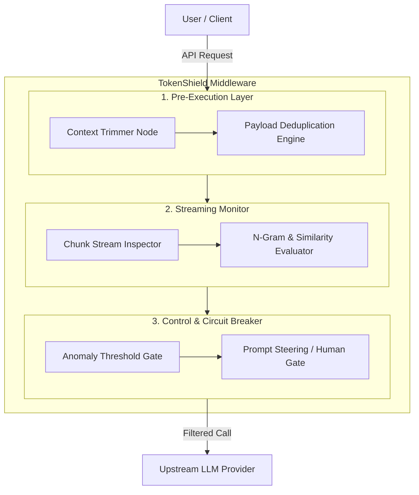

# TokenShield: Real-Time Agentic Trajectory & Token Interceptor

> **Project Specification & Architecture Guide**  
> TokenShield is an intelligent middleware proxy designed to intercept LLM streaming responses, compress redundant context payloads, and halt runaway loops in real time.

---

## Table of Contents
1. [Overview](#overview)
2. [Technical Stack](#technical-stack)
3. [System Architecture](#system-architecture)
4. [Execution Workflow](#execution-workflow)
5. [Benchmark Evaluation Framework](#benchmark-evaluation-framework)
6. [Execution Metrics](#execution-metrics)
7. [Step-by-Step Implementation Strategy](#step-by-step-implementation-strategy)

---

## Overview

TokenShield acts as an adaptive proxy layer between client agents and upstream LLM providers. By combining pre-execution context trimming, in-flight token stream analysis, and automated circuit breaking, TokenShield drastically reduces token waste, lowers latency, and prevents infinite tool/reasoning loops.

---

## Technical Stack

| Layer / Component | Technology | Purpose |
| :--- | :--- | :--- |
| **Core Runtime** | Python 3.11+ (Async IO) | High-concurrency async execution runtime |
| **API Middleware / Proxy** | LiteLLM / FastAPI | Asynchronous HTTP interception & multi-provider routing |
| **Stream Analysis Engines** | RapidFuzz / NLTK | N-gram repetition scoring & semantic similarity analysis |
| | Tiktoken | Real-time token count estimation & chunk calculation |
| **State & Memory** | SQLite | Lightweight persistence for execution trajectories & loop telemetry |
| **Dashboard & Visualizer** | Streamlit | Real-time token metrics, trajectory graphs & manual circuit breakers |

---

## System Architecture



### Component Topology (ASCII Diagram)

```text
                  ┌──────────────────────────────────────────────┐
                  │                 User / Client                │
                  └──────────────────────┬───────────────────────┘
                                         │
                                   [ API Request ]
                                         │
                                         ▼
┌─────────────────────────────────────────────────────────────────────────────────┐
│                               TokenShield Middleware                            │
│                                                                                 │
│   ┌─────────────────────────────────────────────────────────────────────────┐   │
│   │                         1. Pre-Execution Layer                          │   │
│   │                                                                         │   │
│   │   ┌───────────────────────┐         ┌───────────────────────────────┐   │   │
│   │   │  Context Trimmer Node │  ───►   │ Payload Deduplication Engine  │   │   │
│   │   └───────────────────────┘         └───────────────────────────────┘   │   │
│   └────────────────────────────────────┬────────────────────────────────────┘   │
│                                        │                                        │
│                                        ▼                                        │
│   ┌─────────────────────────────────────────────────────────────────────────┐   │
│   │                         2. Streaming Monitor                            │   │
│   │                                                                         │   │
│   │   ┌───────────────────────┐         ┌───────────────────────────────┐   │   │
│   │   │ Chunk Stream Inspector│  ───►   │  N-Gram & Similarity Evaluator│   │   │
│   │   └───────────────────────┘         └───────────────────────────────┘   │   │
│   └────────────────────────────────────┬────────────────────────────────────┘   │
│                                        │                                        │
│                                        ▼                                        │
│   ┌─────────────────────────────────────────────────────────────────────────┐   │
│   │                     3. Control & Circuit Breaker                        │   │
│   │                                                                         │   │
│   │   ┌───────────────────────┐         ┌───────────────────────────────┐   │   │
│   │   │ Anomaly Threshold Gate│  ───►   │ Prompt Steering / Human Gate  │   │   │
│   │   └───────────────────────┘         └───────────────────────────────┘   │   │
│   └────────────────────────────────────┬────────────────────────────────────┘   │
└────────────────────────────────────────┼────────────────────────────────────────┘
                                         │
                                   [ Filtered Call ]
                                         │
                                         ▼
                  ┌──────────────────────────────────────────────┐
                  │              Upstream LLM Provider           │
                  └──────────────────────────────────────────────┘
```

---

## Execution Workflow

The interception lifecycle is divided into three distinct operational phases:

### 1. Context Compression (Pre-Flight)
* **Ingestion:** Raw user messages and tool execution outputs enter the **Context Trimmer Node**.
* **Payload Pruning:** Tool output payloads that exceed configured size limits are stripped of redundant/duplicate fields and summarized via the **Payload Deduplication Engine**.
* **Sliding Window Pruning:** Historical trajectory context is trimmed using sliding window rules, preserving essential system instructions and state while purging stale turns.

### 2. Real-Time Stream Interception (In-Flight)
* **Chunk Inspection:** As the upstream model streams tokens back, chunks are analyzed sequentially by the **Chunk Stream Inspector**.
* **Velocity & Overlap Analysis:** A sliding window evaluator tracks token generation velocity and n-gram overlap between consecutive sentences.
* **Anomaly Scoring:** If repetitive sentence structures, looping phrases, or stalled thought processes are observed, the **N-Gram & Similarity Evaluator** increments the active *Loop Anomaly Score*.

### 3. Circuit Interception & Recovery (Post-Trigger)
* **Stream Termination:** If the *Loop Anomaly Score* exceeds the configured threshold, the upstream connection is halted immediately.
* **State Steering & Recovery:** The **Circuit Breaker** injects dynamic recovery steering instructions into the conversation state:
  > `System: Loop detected. Do not repeat tool X with identical args.`
* **Human Checkpoint Node:** For safety-critical actions or persistent anomalies, execution suspends at a human checkpoint node to await manual intervention or clearance before resuming.

---

## Benchmark Evaluation Framework

To evaluate efficiency and cost improvements over an unmonitored baseline, 10 defined evaluation scenarios are executed:

```
├── Scenarios 1–3: Infinite Tool Execution Loops
│   └── Tools failing with persistent errors, triggering endless unmonitored agent retry cycles.
│
├── Scenarios 4–6: Circular Reasoning Repetition
│   └── Agents trapped in repetitive analytical phrasing without invoking tools or hitting termination strings.
│
├── Scenarios 7–9: Payload Overhead Bloat
│   └── Large raw HTML/JSON responses flooding context vs. TokenShield-compressed payloads.
│
└── Scenario 10: Control Case
    └── Complex multi-turn execution requiring extensive reasoning to measure and verify false-positive rates.
```

---

## Execution Metrics

| Primary Metric | Simple Baseline | TokenShield Agent | Net Target |
| :--- | :--- | :--- | :--- |
| **Tokens Burned per Failed Task** | High *(Unrestricted loop burn)* | Minimal *(Early stream termination)* | **> 75% Reduction** |
| **Average Cost per Failure Event** | Full Context Price ($) | Aborted Chunks Price ($) | **> 75% Savings** |
| **Loop Interception Velocity** | Timeout Limit Exceeded | Instant *(Sliding window trigger)* | **< 5 Seconds** |

---

## Step-by-Step Implementation Strategy

```
[Phase 1] Repository Setup
 └── Initialize Python package structure, API proxy routing, and local SQLite trajectory schema.

[Phase 2] Middleware Core Implementation
 └── Construct async streaming parser and wrap request/response pipelines with Tiktoken and RapidFuzz scoring.

[Phase 3] Control Circuit & UI
 └── Build intervention logic, dynamic system prompt injector, and the real-time Streamlit monitoring dashboard.

[Phase 4] Evaluation Benchmark Suite
 └── Execute the 10 scenario test suites, collect JSON trajectory logs, and assemble benchmark changelog reports.
```